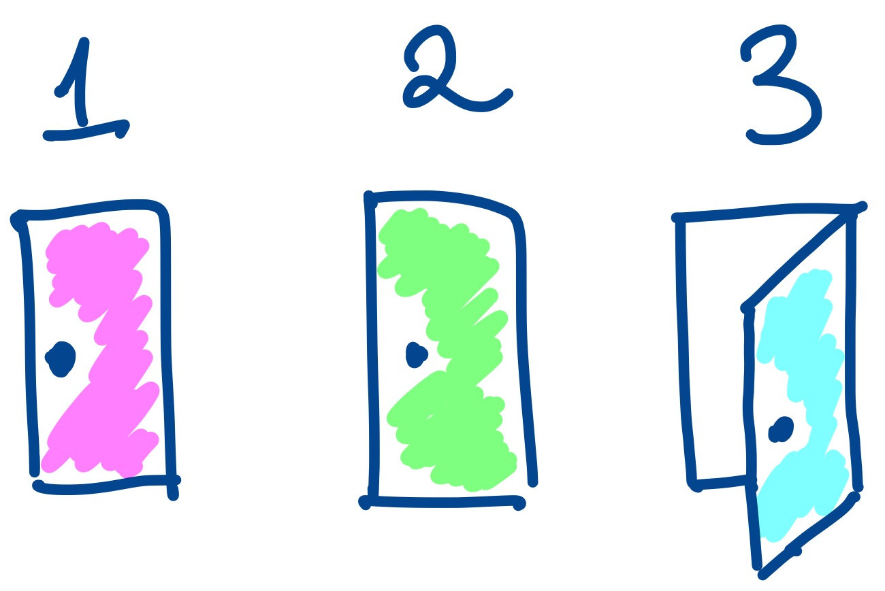

```{r setup, include=FALSE}
knitr::opts_chunk$set(echo = FALSE)
```


In data analysis there is often a distinction between *doing* the data analysis and *communicating* the data analysis. The idea is to analyze the data and then come up with some sort of narrative that explains what is going on with the data. There is a sense in which these are distinct steps of a process.

However, considering the *narrative* or *story* of a data analysis may contribute to improving the quality of a data analysis and so we should re-consider whether the idea of story and the idea of analysis are unrelated. 

What were are *not* talking about here is fitting the data analysis to tell a specific story. The danger that most people fear is that we come up with a story first and the pick and choose the elements of a data analysis that are aligned with that story (and remove the elements that contradict the story). 

The kind of story we are talking about here involves the explanation for the sequence of steps that are taken as part of the analysis. If one were to examine the steps taken in a data analysis, one could come up with a kind of “story” or narrative that could be told about those steps. 

For example, a short data analysis might read as: 

> We read the data in, then we made a histogram of x, and then we ran a linear regression of y on x.

That is the “story” of the analysis. Any real data analysis will likely have a more complex story but the idea of a story or narrative remains. It’s valuable to think about the narrative you are building as you are analyzing the data. It can serve as a way to organize your steps and can guide you to planning future steps.

Like with any story, the story or narrative of the data analysis has to make sense. The problem with the story I just told above is that it makes no sense. Why did we make a histogram? Why not a boxplot or a scatterplot? Why did we run a regression? Why not use an approach that is more flexible? These questions are not about the story of how the results are interpreted, they are about the story of the analysis itself.

## Closing All the Doors

In the documentary *Showrunners: The Art of Running a TV Show*, Bill Prady, creator of the long-running comedy TV show *The Big Bang Theory* talks about the challenges of writing comedy versus writing drama. He claims writing comedy is harder than drama because in comedy you’re often moving people into ridiculous situations. But simply putting someone in a ridiculous situation isn’t inherently funny. Rather, you have to write the story so that the character *must* be put into that situation. Prady says:

> Our slang in the [writer’s] room is you have to close all the other doors, so that the only door available to this character is the door that leads to the big block comedy scene you want to do.... You have to get to the point where the audience would say, “You know what, if I were in that situation, damn it if I wouldn’t do the exact same thing!”

Suppose you’re watching a movie about a bank robbery at night and the robbers are having all kinds of problems because it’s dark. Maybe that’s funny, but not if you’re thinking to yourself “Why didn’t they just bring some flashlights?” If you find yourself asking that question, then this is a **narrative failure**. The writers of the story didn’t close all of the doors. They didn’t come up with a reason to explain *why* the robbers didn’t have flashlights to begin with.

Narrative failures in a movie or TV show represent gaps in logic that the viewer has to either impute or just be confused about. In either case, it’s not something you want the viewer to do. You want the story to just *make sense* and for each sequence in the story to follow from previous events.

The same is true in data analysis. If you’ve ever seen a presentation of a data analysis and thought, “Why didn’t they just...” then the presenter failed to close a door. For example, how many fancy machine learning presentations have you seen where you thought, “Why didn’t they just run a logistic regression?”

## Types of Data Analysis Failure




A narrative failure in a data analysis is a failure to justify the path chosen in the analysis vis a vis any number of plausible alternative paths that could have been taken. If those alternatives have not been ruled out, then a gap remains and the audience will be confused about why the alternative was not tried. It is the job of the analyst to either execute some of these alternate analyses or present some evidence regarding why they are not preferable. Ruling out these alternative analyses is part of building a successful **data analysis narrative**.

The idea of narrative failure gets to a difficult aspect of data analysis that students have trouble understanding, which is that rarely is there a single “right” or “best” way to do an analysis. In other words, rarely is there a single “door” to walk through. Often, there are many doors to walk through, and it almost doesn’t matter which door you choose, just so long as you manage to close all of the other ones along the way. If you choose door 1 then people might ask “Why didn’t you choose door 2?”. And if you choose door 2 then people will ask about door 1. There’s no perfect  door to walk through, you just have to close one and walk through the other.

